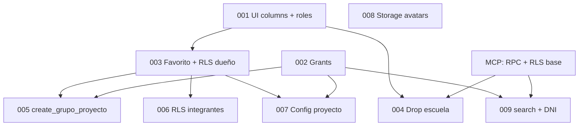

# Migraciones SQL — Supabase (Classify)

Historial cronológico de los cambios aplicados a la base de datos del proyecto **Classify** (`jgrtmokyqdvdxsldmkou`).

Los archivos fuente viven en `supabase/migrations/`. Este documento describe **qué hace cada migración**, **qué objetos toca** y **cómo se relaciona con la app**.

> Para el esquema completo de tablas, RLS y RPC, ver también [`estructura_db.md`](./estructura_db.md).

---

## Cómo aplicarlas

1. **Supabase Dashboard** → SQL Editor → pegar y ejecutar cada archivo en orden numérico.
2. **Supabase CLI** (si está configurado): `supabase db push` o `supabase migration up`.
3. **MCP Supabase**: algunas funciones RPC iniciales (`find_user_id_by_email`, `get_group_member_emails`, políticas RLS base) se aplicaron directamente en el proyecto remoto antes de quedar versionadas en archivos locales; se documentan en la sección [Cambios previos vía MCP](#cambios-previos-vía-mcp).

**Orden obligatorio:** `001` → `002` → … → `009`.

---

## Resumen rápido

| # | Archivo | En una línea |
|---|---------|--------------|
| 001 | `001_grupos_proyectos_ui_columns.sql` | Columnas UI en proyectos + seed de roles |
| 002 | `002_grant_public_schema_api_roles.sql` | Permisos PostgREST para `anon` / `authenticated` |
| 003 | `003_grupos_proyectos_favorito_and_crud_rls.sql` | Favoritos + políticas RLS de creación/edición |
| 004 | `004_drop_escuela_and_members.sql` | Elimina columna `escuela` (obsoleta) |
| 005 | `005_create_grupo_proyecto_rpc.sql` | RPC atómica para crear proyecto + dueño |
| 006 | `006_rls_member_access.sql` | Integrantes pueden leer proyectos y tareas compartidas |
| 007 | `007_project_config_columns.sql` | Configuración de proyecto + RPC email del dueño |
| 008 | `008_profile_avatars_storage.sql` | Bucket Storage `avatars` + políticas |
| 009 | `009_search_usuarios_dni.sql` | Búsqueda de usuarios ampliada (incluye DNI) |

---

## 001 — Columnas UI y roles base

**Archivo:** `001_grupos_proyectos_ui_columns.sql`

### Cambios en tablas

| Tabla | Cambio |
|-------|--------|
| `grupos_proyectos` | `escuela varchar(20)` *(eliminada en 004)* |
| `grupos_proyectos` | `estado_proyecto varchar(20) DEFAULT 'Abierto'` |
| `grupos_proyectos` | CHECK `estado_proyecto IN ('Abierto', 'Cerrado')` |
| `roles` | INSERT idempotente: `admin`, `profesor`, `alumno` |

### Motivo

Preparar la UI de listado y detalle de proyectos con estado Abierto/Cerrado, y asegurar que existan los tres roles usados por la app.

### Relación con la app

- Columna `estado_proyecto` → panel «Hitos y Estado» en configuración del proyecto.
- Roles → registro (`alumno` por defecto), permisos de profesor para `anteproyecto_validado`.

---

## 002 — Grants del esquema `public`

**Archivo:** `002_grant_public_schema_api_roles.sql`

### Cambios

Restaura los permisos estándar de Supabase/PostgREST:

- `GRANT USAGE ON SCHEMA public` → `postgres`, `anon`, `authenticated`, `service_role`
- Tablas: `SELECT/INSERT/UPDATE/DELETE` para `anon` y `authenticated`; `ALL` para `postgres` y `service_role`
- Rutinas, secuencias y `ALTER DEFAULT PRIVILEGES` equivalentes

### Motivo

Sin estos grants, las peticiones del cliente Supabase (anon key + JWT) fallan al acceder a tablas o RPC aunque RLS esté bien configurado.

### Relación con la app

Base para que Express (`createUserClient`) y el frontend puedan leer/escribir vía PostgREST.

---

## 003 — Favoritos y RLS de CRUD (dueño)

**Archivo:** `003_grupos_proyectos_favorito_and_crud_rls.sql`

### Cambios en tablas

| Tabla | Cambio |
|-------|--------|
| `grupos_proyectos` | `es_favorito boolean NOT NULL DEFAULT false` |

### Políticas RLS nuevas

| Política | Tabla | Operación | Regla |
|----------|-------|-----------|-------|
| `proyecto_profesor_insert_own` | `proyecto_profesor` | INSERT | `id_profesor = auth.uid()` |
| `proyecto_profesor_delete_own` | `proyecto_profesor` | DELETE | `id_profesor = auth.uid()` |
| `grupos_proyectos_insert_auth` | `grupos_proyectos` | INSERT | cualquier `authenticated` |
| `grupos_proyectos_update_owner` | `grupos_proyectos` | UPDATE | dueño en `proyecto_profesor` |
| `grupos_proyectos_delete_owner` | `grupos_proyectos` | DELETE | dueño en `proyecto_profesor` |

### Motivo

- `es_favorito` alimenta el carrusel del dashboard.
- Las políticas permiten crear proyectos y restringir edición/borrado al dueño (`proyecto_profesor`).

### Relación con la app

- `PATCH /api/projects/:id/favorite` (solo dueño).
- Edición y borrado en `/proyectos` y configuración del proyecto.

---

## 004 — Eliminar columna `escuela`

**Archivo:** `004_drop_escuela_and_members.sql`

### Cambios

```sql
ALTER TABLE grupos_proyectos DROP COLUMN IF EXISTS escuela;
```

### Notas

El comentario del archivo remite a funciones RPC y RLS de integrantes aplicadas vía MCP (ver sección final). No hay más DDL en este archivo.

### Motivo

La columna `escuela` (añadida en 001) no se usaba en la UI; se simplifica el modelo.

---

## 005 — RPC `create_grupo_proyecto`

**Archivo:** `005_create_grupo_proyecto_rpc.sql`

### Función

```sql
create_grupo_proyecto(p_nombre varchar, p_descripcion text DEFAULT NULL) → json
```

- `SECURITY DEFINER`, `search_path = public`
- Inserta fila en `grupos_proyectos` (`estado_proyecto = 'Abierto'`, `es_favorito = false`)
- Inserta vínculo en `proyecto_profesor` con `auth.uid()`
- Devuelve el grupo como JSON
- `GRANT EXECUTE` a `authenticated`

### Motivo

Un `INSERT ... RETURNING` directo fallaba por RLS: el usuario aún no era «dueño» en el mismo statement. La RPC ejecuta ambos inserts en una transacción como `SECURITY DEFINER`.

### Relación con la app

- `POST /api/projects` → creación de proyecto desde el modal.

---

## 006 — RLS lectura para integrantes

**Archivo:** `006_rls_member_access.sql`

### Políticas RLS nuevas

| Política | Tabla | Regla |
|----------|-------|-------|
| `grupos_proyectos_select_member` | `grupos_proyectos` | SELECT si el usuario está en `grupo_estudiante` para ese `id_grupo` |
| `grupo_estudiante_select_own` | `grupo_estudiante` | SELECT si `id_usuario = auth.uid()` |
| `tareas_grupo_select_member` | `tareas_grupo` | SELECT si integrante del grupo vía `grupo_estudiante` |

### Motivo

Antes solo el dueño veía el proyecto. Los alumnos invitados necesitan leer proyecto y tareas del kanban sin poder editarlos (salvo lo que permita la API).

### Relación con la app

- Listado `/proyectos` para integrantes.
- Vista de tareas compartidas y dashboard «pendientes».

---

## 007 — Configuración del proyecto

**Archivo:** `007_project_config_columns.sql`

### Cambios en tablas

| Columna | Tipo | Default | Uso |
|---------|------|---------|-----|
| `alcance_detalle` | `text` | — | Alcance del proyecto |
| `notas_alcance` | `text` | — | Notas en panel lateral |
| `anteproyecto_validado` | `boolean` | `false` | Checkbox solo profesor |
| `link_respaldo` | `text` | — | URL documentación respaldo |
| `link_calificaciones` | `text` | — | URL calificaciones |
| `documentos` | `jsonb` | `'[]'` | Lista `{ nombre, url }` |

### Función RPC

```sql
get_project_owner_email(p_id_grupo integer) → text
```

- Lee email del dueño desde `proyecto_profesor` + `auth.users`
- `SECURITY DEFINER`, `GRANT EXECUTE` a `authenticated`

### Relación con la app

- Página `/proyectos/:id/configuracion` (pestañas Alcance, Documentaciones, Equipo, Calificaciones).
- Sustituye el flujo de tabla `Documentacion_Aprobacion` por JSONB de enlaces externos.

---

## 008 — Avatares en Storage

**Archivo:** `008_profile_avatars_storage.sql`

### Bucket

| Campo | Valor |
|-------|--------|
| `id` / `name` | `avatars` |
| `public` | `true` |
| `file_size_limit` | 2 MB (`2097152`) |
| `allowed_mime_types` | `image/jpeg`, `image/png`, `image/webp` |

Convención de ruta: `{user_id}/profile.{ext}`

### Políticas en `storage.objects`

| Política | Operación | Regla |
|----------|-----------|-------|
| `avatars_select_public` | SELECT | Bucket `avatars` (público) |
| `avatars_insert_own` | INSERT | Carpeta raíz = `auth.uid()` |
| `avatars_update_own` | UPDATE | Solo archivos en carpeta propia |
| `avatars_delete_own` | DELETE | Solo archivos en carpeta propia |

### Relación con la app

- Página `/preferencias` — subida y visualización de foto de perfil.
- URL pública del bucket para mostrar avatar en sidebar.

---

## 009 — Búsqueda de usuarios con DNI

**Archivo:** `009_search_usuarios_dni.sql`

### Función (reemplazo)

```sql
search_usuarios_for_invite(p_query text) → TABLE (
  id_usuario uuid,
  email text,
  nombre text,
  apellido text,
  dni text   -- columna nueva en el resultado
)
```

**Criterios de búsqueda** (ILIKE/LIKE parcial, máx. 15 resultados):

- `usuarios.dni`
- `auth.users.email`
- `usuarios.nombre`
- `usuarios.apellido`
- nombre + apellido concatenados

Reemplaza la versión anterior (solo email/nombre/apellido) con `DROP FUNCTION IF EXISTS` + `CREATE OR REPLACE`.

### Relación con la app

- `GET /api/users/search?q=` → componente `EmailChipInput` al invitar integrantes al proyecto.
- Permite encontrar compañeros por DNI además de correo o nombre.

---

## Cambios previos vía MCP

Algunos objetos existían en el proyecto Supabase **antes** de quedar en archivos numerados locales, o se aplicaron con el MCP de Supabase. Conviven con las migraciones 001–009:

| Objeto | Tipo | Descripción |
|--------|------|-------------|
| Políticas RLS base | RLS | `usuarios`, `roles`, `proyecto_profesor`, `grupos_proyectos` (SELECT dueño), `tareas_grupo` |
| `find_user_id_by_email(p_email)` | RPC | Resuelve email → UUID en `auth.users` |
| `get_group_member_emails(p_id_grupo)` | RPC | Lista emails de integrantes de un grupo |
| `search_usuarios_for_invite(p_query)` | RPC | Versión inicial (sin DNI); **supersedida por 009** |
| RLS `grupo_estudiante` | RLS | SELECT/INSERT/DELETE para el **dueño** del proyecto |

Si clonás la BD desde cero, además de ejecutar 001–009 necesitás recrear estas piezas o exportar el esquema completo desde Supabase.

---

## Dependencias entre migraciones



---

## Checklist al agregar migración `010+`

1. Crear `supabase/migrations/010_descripcion_corta.sql`.
2. Documentar aquí: propósito, tablas/columnas, políticas, RPC, Storage.
3. Actualizar [`estructura_db.md`](./estructura_db.md) (sección 6.3 y tablas afectadas).
4. Si hay endpoint nuevo, documentar en `AGENTS.md` / `CAMBIOS.md` según corresponda.

---

## Historial

| Fecha | Migración | Nota |
|-------|-----------|------|
| 2026 | 001–007 | Flujo proyectos, RLS, configuración |
| 2026 | 008 | Preferencias — avatares |
| 2026 | 009 | Invitaciones — búsqueda por DNI |
